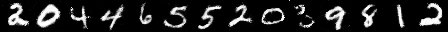

## CGAN

This is the code I used to complete PA3(Conditional GAN) in the course "Computer Graphics Fundamentals" at Tsinghua University.

Since the final model file is over 5MB and cannot be uploaded, I put it on the following link: [CGAN](https://cloud.tsinghua.edu.cn/d/1ecbd3b621e244d388e8/)

                                                                                  

#### Usage

Download the model file and place it in the same directory as `CGAN.py`. Run `CGAN.py` to output the sample image `result.png`, ensuring that the jittor framework is installed.

If you want to train the model, simply run `CGAN_train.py` directly. The program will automatically train and save the model file in the current directory at regular intervals.

